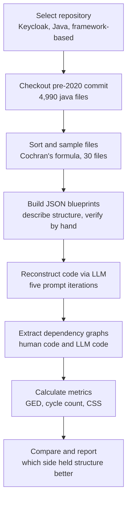

# Dependency Structure Analysis: Human Code vs LLM Reconstruction

**Course:** CSE423 — Software Architecture
**Repository studied:** [keycloak/keycloak](https://github.com/keycloak/keycloak)

This project measures how a large language model changes the dependency structure of code when asked to rebuild real, previously-written Java files. 30 files were sampled from Keycloak at a pre-2020 commit, each file's dependency structure was recorded, the same files were rebuilt by an LLM from structured JSON descriptions, and the two sets of dependency graphs were compared using Graph Edit Distance, Cycle Count, and Centralization Shift Score.

## Workflow

## Repository selection

**Repository:** Keycloak (identity and access management system, Java, web backend / multi-module application)

- Language: Java
- Initial file count: **8,215 Java files** (`git ls-files "*.java" | wc -l`)
- Commit history filtered to before January 1, 2020 (`git log --before="2020-01-01"`)
- Commit checked out: `56d53b191a50deeecb782a1e4b723e906ad17b4f`
- File count at this commit: **4,990 Java files**

Keycloak is a real, framework-based multi-module system with multiple recognizable layers (services, models, admin console, testsuite), satisfying the structure requirement of the assignment.

> **Open item:** exact folder listing, total commit count, and confirmed active-development span are still needed to fully back this section with evidence.

## Sampling procedure

All 4,990 files at the checked-out commit were grouped by lines of code:

| Category | LOC range | Population (N_h) |
|---|---|---:|
| Small | 0–50 | 1,439 |
| Medium | 51–99 | 1,596 |
| Large | ≥100 | 1,955 |
| **Total** | | **4,990** |

Sample size was determined with Cochran's formula:

$$n_0 = \frac{Z^2 pq}{e^2}$$

With Z = 1.645 (90% confidence), p = q = 0.5, e = 0.15:

$$n_0 = \frac{(1.645)^2(0.5)(0.5)}{(0.15)^2} = 30.08$$

Adjusted for the finite population of 4,990 files:

$$n = \frac{n_0}{1 + \frac{n_0 - 1}{N}} = \frac{30.08}{1 + \frac{30.08-1}{4990}} \approx 29.9 \rightarrow \textbf{30 files}$$

Allocated proportionally across categories:

$$n_h = \frac{N_h}{N} \times n$$

| Group | Calculation | Sample |
|---|---|---:|
| Small | 1439/4990 × 30 = 8.65 | 9 |
| Medium | 1596/4990 × 30 = 9.59 | 10 |
| Large | 1955/4990 × 30 = 11.74 | 11 |
| **Total** | | **30** |

This keeps the sample in the same proportions as the full repository (28.8% small, 32.0% medium, 39.2% large).

<b>Files sampled (click to expand)</b>

| Category | Files |
|---|---|
| Small (9) | Autheticator, ClientAuthUtil, KeyUse, KeycloakTransactionCommitter, MissingAssertionSig, PermissionTicketListQuery, Spi, TimerProvider, UndertowAppServerArquillianExtension |
| Medium (10) | DeviceTypeType, IdpConfirmLinkAuthenticator, ImportTest, KeyStoreDefinition, LDAPDnTest, LoggedInPageHeader, MediumType, RealmResourceSPI, SAML11AuthorizationDecisionQueryType, StringSerializationTest |
| Large (11) | AbstractClientRegistrationTest, ApplicationsBean, AuthorizationBean, GetRolesCmd, JWEKeyStorage, LDAPObject, OIDCLoginProtocolFactory, PersonalInfoTest, ThemeResourceDefinition, UserCredentialStoreManager, UserUpdateProfileContext |

## JSON blueprints

Each of the 30 sampled files was turned into a structured JSON blueprint before any regeneration happened. Every entry records:

- `file_name` — exact file name, used to match the reconstruction back to the original
- `description` — purpose, package, class structure, fields, constructors, method logic, data flow, object creation, exception handling, design patterns, and language features
- `imports` — every import statement in the original file
- `dependency` — project-class references, external library references, and method-level call graph

This is what made a fair reconstruction possible — the LLM worked from the same structural facts a developer gets from reading the class carefully, rather than reverse-engineering the file from scratch. Every description was checked by hand against its source file before use.

## LLM reconstruction — prompt iterations

The blueprints were used to prompt an LLM to regenerate each file. The prompt went through five versions, each responding to a specific structural problem seen in the previous output:

| Version | Focus | Problem it fixed |
|---|---|---|
| 1. Initial prompt | Write the class from the JSON description | Baseline — too loose, left room to invent structure |
| 2. Structural reconstruction | Exact package/class match, exact inheritance, every import/dependency used as real code, self-check pass | Didn't guarantee listed dependencies became real code |
| 3. Exact structural fidelity | Build a checklist from the blueprint, forbid unlisted imports, audit output against checklist | Needed a hard rule against invented dependencies |
| 4. Final verification | One more pass against the JSON description | Caught remaining mismatches |
| 5. Dependency graph & PNG generation | Generate a graph per file, same format as the human graphs, exported as PNG | Needed LLM output measurable with the same metrics |

Full prompt text for each iteration is in [`Prompt_Iteration.md`](./Prompt_Iteration.md).

## Dependency graph extraction

A dependency graph was produced for every one of the 30 files on both sides:

- **Human (H):** graph built from the checked-out pre-2020 commit
- **LLM (L):** graph built from the LLM output, same format as H

Both sets came out as a **star/hub topology** in every file: one center node (the file), edges pointing outward to each dependency, no leaf-leaf edges, no edges back into the center. This held across all 60 graphs with no exceptions.

## Metrics

Under a star topology, several values follow directly from fan-out (outgoing edge count):

| Metric | Value | Reason |
|---|---|---|
| Node count \|M\| | fan-out + 1 | center file + one node per dependency |
| Edge count \|E\| | fan-out | one edge per dependency |
| Cycle Count (CC) | always 0 | a star graph has no path back to a visited node |
| Max centrality (raw) | fan-out | the center connects to every other node |

**Graph Edit Distance** — dependency present in only one graph = 2 edits (node + edge); present in both = 0 edits.

**Centralization Shift Score:**

$$CSS = \text{fanout}_L - \text{fanout}_H$$

### Totals by category

| Category | Σ fanout_H | Σ fanout_L | Σ CSS | % change | Σ GED |
|---|---:|---:|---:|---:|---:|
| Small | 29 | 29 | 0 | 0.0% | 0 |
| Medium | 68 | 55 | −13 | −19.1% | 34 |
| Large | 195 | 116 | −79 | −40.5% | 186 |
| **Total** | **292** | **200** | **−92** | **−31.5%** | **220** |

Full per-file table is in [`Metric_Calculation_and_Accuracy.md`](./Metric_Calculation_and_Accuracy.md).

## Findings

- **Cycle Count gives no signal here** — both H and L are 0 cycles for all 30 files, a structural guarantee of the star topology at file-level granularity.
- **Small files reconstruct with zero structural loss** — all 9 small files have GED = 0 and CSS = 0.
- **Larger files lose dependencies, not gain them** — 101 dependencies missing across the sample, only 9 added. GED (220 total) is driven almost entirely by loss.
- **What's dropped is mostly boilerplate** — standard-library collection types (`List`, `Map`, `Set`, `HashMap`, `ArrayList`, `Collections`) and test scaffolding (`Before`, `Test`, `assertThat`), rarely domain-specific classes.
- **CSS is negative wherever it differs at all, never positive** — the LLM decentralizes, it doesn't collapse into a God class.
- **Loss scales with file size** — Small: 0%, Medium: −19.1%, Large: −40.5%.

The LLM tends to preserve *what* a class does while under-reconstructing *how much surrounding machinery* it relied on, and that gap widens as file complexity increases.

## Limitations

- Graphs are per-file, not a whole-codebase call graph — cross-file coupling and cycles aren't captured.
- CC = 0 for every file is a property of file-level graphs, not proof the whole system is acyclic.
- GED uses a simple name-match cost model since the assignment doesn't fix one.

## Repository contents

| File | Description |
|---|---|
| `Human_Java_Files.zip` | Original 30 Java files from the pre-2020 commit |
| `LLM_Generated_Java_Files.zip` | LLM-reconstructed versions of the same 30 files |
| `Human_Java_Files_Graph.zip` | Dependency graph PNGs for the human files |
| `LLM_Generated_Java_Files_Graph.zip` | Dependency graph PNGs for the LLM files |
| `Small_Descriptions.json` / `Medium_Descriptions.json` / `Large_Descriptions.json` | JSON blueprints per category |
| `Prompt_Iteration.md` | Full text of all 5 prompt versions |
| `Metric_Calculation_and_Accuracy.md` | Full per-file metric tables |
| `CSE423_Project_Report.md` | Full project report |

## Still needed

1. Total commit count, active-development span, and folder listing for Section 2 (repository selection evidence).
2. Confirmation that all 30 regenerated files compile or parse cleanly.
